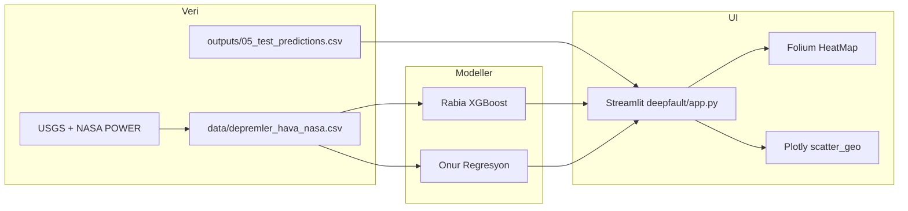

# DeepFault

**AI-Powered Earthquake Risk & Early Warning System** — Türkiye ve çevresi için yapay zeka destekli sismik risk değerlendirme ve görselleştirme platformu.

> **Önemli:** Bu uygulama resmi bir deprem erken uyarı sistemi değildir. Ürettiği skorlar istatistiksel olasılık tahminleridir; acil durumlarda [AFAD](https://www.afad.gov.tr/) ve yerel yetkilileri izleyin.

---

## Özellikler

| Sekme | Açıklama |
|--------|----------|
| **Ana Sayfa** | Sistem özeti, KPI şeridi, logo ve yasal uyarı |
| **Risk Haritası** | **Folium HeatMap** + **Plotly scatter_geo**; il, tarih aralığı ve yarıçapa duyarlı |
| **Model Çıktıları** | Bölgesel risk zaman serisi, büyüklük dağılımı, grid hücreleri, günlük aktivite; veri yoksa grafik gizlenir |
| **Canlı Çıkarım** | Rabia (XGBoost) + Onur (regresyon) birleşik skor ve ajan yorum özeti |

**Sidebar:** 81 il veya özel koordinat, agregasyon yarıçapı (km), tarih aralığı, webhook / Telegram bildirimi, kullanıcı notu.

---

## Hızlı başlangıç

### Gereksinimler

- Python **3.10+** (önerilen: 3.11 veya 3.12)
- Aşağıdaki veri ve model dosyalarının repoda mevcut olması (Git LFS ile gelir)

### Kurulum

```bash
git clone <repo-url>
cd real_time_earthquake_app

python -m venv .venv
source .venv/bin/activate   # Windows: .venv\Scripts\activate

pip install -r deepfault/requirements.txt
```

> Ana dizindeki `requirements.txt` tam ortam dökümüdür. Yalnızca Streamlit uygulaması için **`deepfault/requirements.txt`** yeterlidir.

### Çalıştırma

Proje kökünden:

```bash
streamlit run deepfault/app.py
```

Tarayıcıda genelde `http://localhost:8501` açılır.

### Entegrasyon testi

```bash
python deepfault/test_integration.py
```

Beklenen çıktı: `ALL PASSED`

---

## Modeller

| Model | Dosya | Görev |
|--------|--------|--------|
| **Rabia · XGBoost (kalibre)** | `outputs/deepfault_Rabia_TIME_SERIES_V4_BEST_FINAL_calibrated_model.joblib` | 7 gün içinde M≥4 olasılığı (sınıflandırma) |
| **Onur · Regresyon** | `onur/model_deepfault_mag.pkl`, `onur/model_deepfault_days.pkl` | Tahmini max büyüklük ve büyük olaya kalan gün |

Birleşik risk skoru her iki modelin çıktılarından türetilir. Tahmin grid verisi `outputs/05_test_predictions.csv` dosyasındadır.

**Tahmin tarih aralığı:** `2024-01-01` → `2026-03-18` (sidebar otomatik sınırlar).

---

## Veri kaynakları

Ham olay verisi: `data/depremler_hava_nasa.csv`

| Kaynak | İçerik |
|--------|--------|
| [USGS](https://earthquake.usgs.gov/) | Deprem konumu, büyüklük, derinlik |
| [NASA POWER](https://power.larc.nasa.gov/) | Olay anı meteoroloji |
| Astronomik hesaplamalar | Ay evresi, güneş lekesi, F10.7 akısı |

### Temel sütunlar (`depremler_hava_nasa.csv`)

| Sütun | Açıklama |
|--------|----------|
| `time` | Olay zamanı |
| `magnitude` | Büyüklük (M) |
| `latitude`, `longitude` | Episantr koordinatları |
| `depth_km` | Derinlik (km) |
| `state`, `city_name`, `country` | Konum bilgisi |
| `moon_phase`, `sunspot_number`, `solar_flux_f107` | Astronomik değişkenler |
| `temperature`, `humidity`, `pressure`, `weather_desc` | Hava durumu |

---

## Proje yapısı

```
real_time_earthquake_app/
├── deepfault/                 # Ana Streamlit uygulaması
│   ├── app.py                 # Giriş noktası
│   ├── sidebar.py             # Kontrol paneli
│   ├── inference.py           # Canlı model çıkarımı
│   ├── analytics.py           # Tarih / yarıçap agregasyonları
│   ├── maps.py                  # Folium + Plotly haritalar
│   ├── charts.py                # Plotly grafikleri
│   ├── features_rabia.py        # Canlı özellik üretimi
│   ├── agent_commentary.py      # Ajan yorum metni
│   ├── assets/                  # Logo vb.
│   └── test_integration.py
├── data/
│   └── depremler_hava_nasa.csv
├── outputs/
│   ├── 05_test_predictions.csv
│   ├── 04_model_metrics.json
│   └── deepfault_Rabia_...joblib
├── onur/                      # Regresyon modelleri ve pipeline
├── rabia/                     # XGBoost eğitim / sunum
├── emirkan/                   # Tutarlılık ve uyarı motoru (ayrı modül)
└── README.md
```

---

## Mimari (özet)



- **Oturum durumu:** İl/koordinat, yarıçap ve tarih aralığı değişince çıkarım otomatik yenilenir.
- **Önbellek:** `@st.cache_data` ile harita ve tarih sınırları.
- **Mock veri kullanılmaz;** tüm grafikler gerçek CSV ve model dosyalarından beslenir.

---

## Bildirimler (isteğe bağlı)

Sidebar üzerinden:

- **Webhook URL** — JSON payload ile harici ajan
- **Telegram** — Bot token + chat ID

“Ajan'a Gönder” ile seçili bölge, tarih aralığı ve model özeti iletilir.

---

## Geliştirici ekibi

- **Rabia AŞIK** — ML Engineer (XGBoost)
- **Emirkan EFE** — AI Engineer
- **Onur KARASÜRMELİ** — Data Scientist (regresyon, veri mühendisliği)

---

## Lisans

Bu depodaki `LICENSE` dosyasına bakın.

---

## İlgili alt projeler

| Klasör | Açıklama |
|--------|----------|
| `rabia/` | XGBoost zaman serisi pipeline ve sunum |
| `onur/` | Büyüklük / gün regresyon modelleri |
| `emirkan/` | Tutarlılık motoru ve uyarı simülasyonu |

Ana kullanıcı arayüzü **`deepfault/app.py`** üzerinden çalıştırılır.
